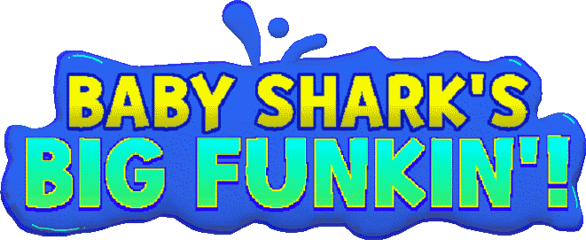

# Baby Shark's Big Funkin!

Heavily Modified of Psych Engine. combined with Kade, Dave, Codename (minor codes), and Base Engine.

This Engine is windows exclusive. (Apple and Linux Support Soon.)

# Credits:

### Psych Engine:
* Shadow Mario - Programmer
* RiverOaken - Artist

### Dave Engine:
* Vs. Dave and Bambi Teams

### Base Engine:
* Funkin' Crew

### Codename Engine:
* WizardMantis441 - Programmer
* YoshiCrafter29 - Ex-Programmer

### Denpa Engine:
* BlueVapor1234 - Main Programmer & Creator
* Toadette8394 - Co Programmer
* YanniZ06 - Co Programmer

### Special Thanks:
* bbpanzu - Ex-Programmer
* SqirraRNG - Crash Handler and Base code for Chart Editor's Waveform
* KadeDev - Fixed some cool stuff on Chart Editor and other PRs, Programmer of Kade Engine
* iFlicky - Composer of Psync and Tea Time, also made the Dialogue Sounds
* MAJigsaw77 - .MP4 Video Loader Library (hxvlc) and hxdiscord_rpc
* Keoiki - Note Splash Animations
* superpowers04 - LUA JIT Fork and some Lua reworks
* Raltyro - Maintainer of Psike Engine