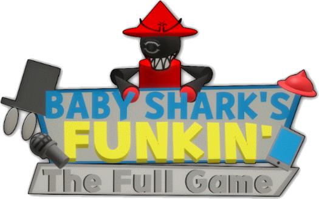

# Baby Shark's Funkin

Heavily Modded of Psych Engine. combined with Kade, Dave, Base Engines.

# Credits:

### Psych Engine:
* Shadow Mario - Programmer
* RiverOaken - Artist

### Dave Engine:
* Vs. Dave and Bambi Teams

### Base Engine:
* Funkin' Crew

### Special Thanks:
* bbpanzu - Ex-Programmer
* Yoshubs - Ex-Programmer, New Input System
* SqirraRNG - Crash Handler and Base code for Chart Editor's Waveform
* KadeDev - Fixed some cool stuff on Chart Editor and other PRs, Programmer of Kade Engine
* iFlicky - Composer of Psync and Tea Time, also made the Dialogue Sounds
* PolybiusProxy - .MP4 Video Loader Library (hxCodec)
* Keoiki - Note Splash Animations
* Smokey - Sprite Atlas Support
* superpowers04 - LUA JIT Fork and some Lua reworks
* Raltyro - Maintainer of Psike Engine
_____________________________________

## Mod Support
* Probably one of the main points of this engine, you can code in .lua or .hx files outside of the source code, making your own weeks without even messing with the source!
* Comes with a Mod Organizing/Disabling Menu.